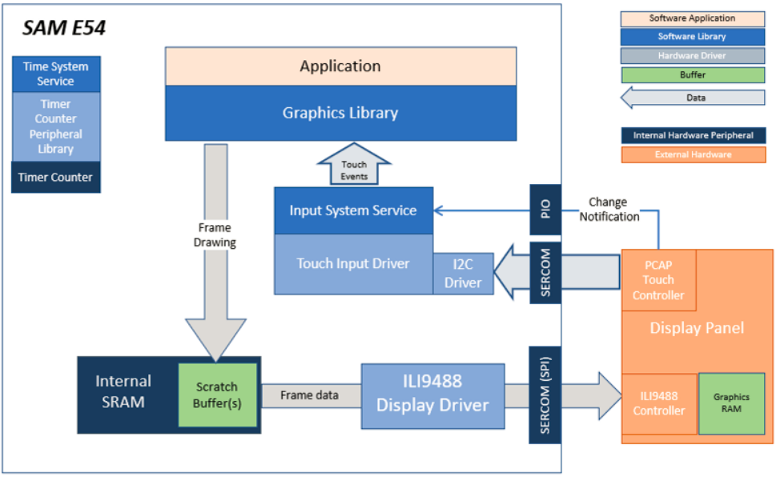
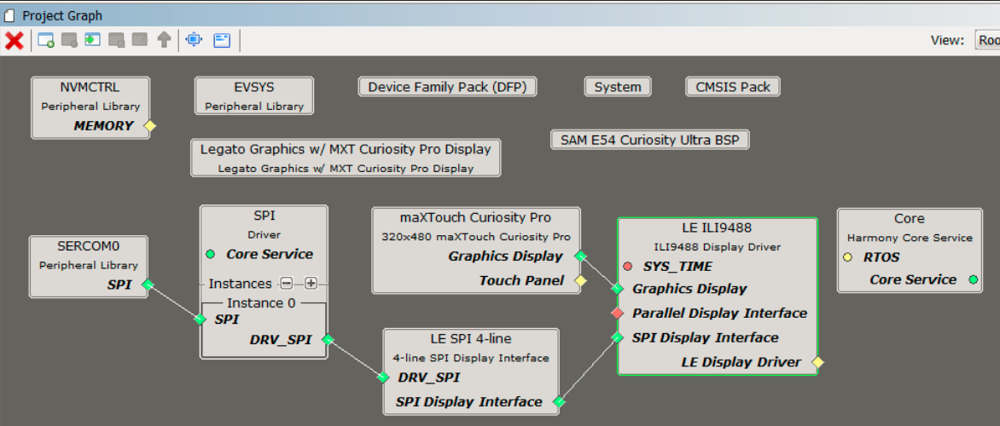
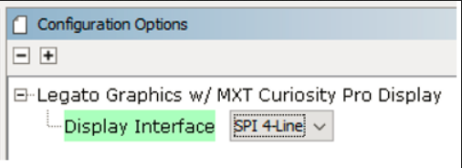
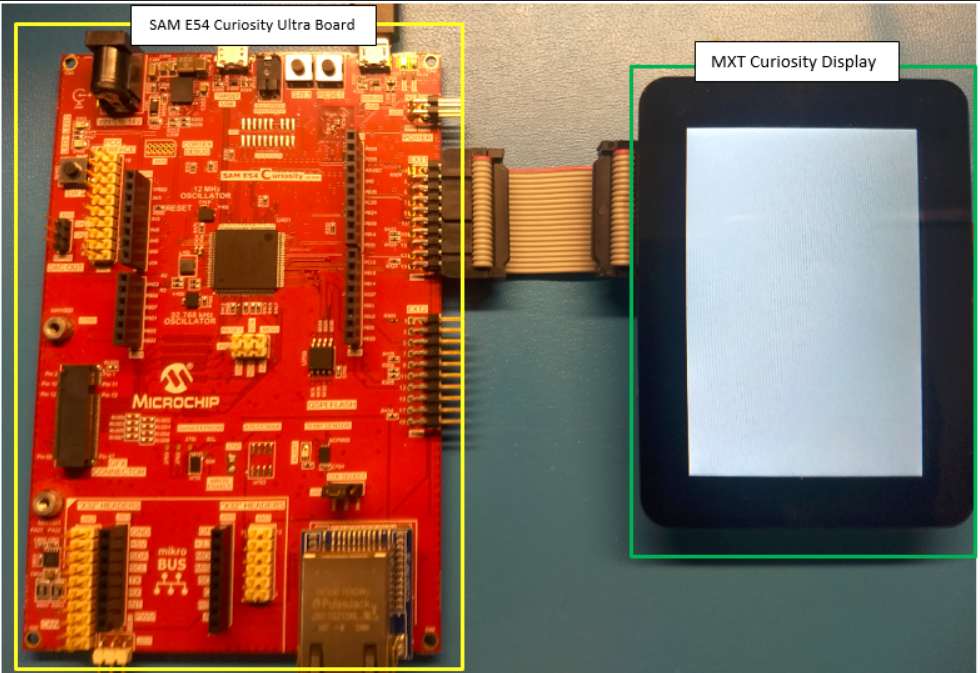
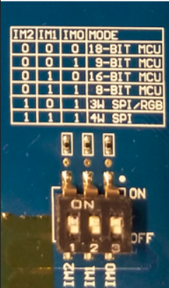
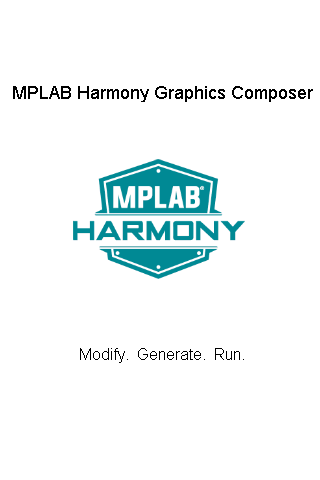

 blank_quickstart_e54_cult_cpro_spi.X

Defining the Architecture
-------------------------

The application uses the ILI9488 display driver APIs to render text and an image onto the screen.

### Demonstration Features

* ILI9488 display controller driver 
* 4-line SPI display interface driver 
* Time system service, timer-counter peripheral library and driver 
* 16-bit RGB565 color depth support (65535 unique colors) 
* Port, I2C peripheral library 

Creating the Project Graph
--------------------------

The Project Graph diagram shows the Harmony components that are included in this application. Lines between components are drawn to satisfy components that depend on a capability that another component provides.

Adding the **SAM E54 Curiosity Ultra BSP** and **Legato Graphics w/ MXT Curiosity Pro Display** Graphics Template component into the project graph will automatically add the components needed for a graphics project and resolve their dependencies. It will also configure the pins needed to drive the external peripherals like the display and the touch controller. 

To configure the project for an SPI Interface, set the Display Interface setting for the **Legato Graphics w/ MXT Curiosity Pro Display** component to SPI 4-Line. 

Building the Application
------------------------

The parent directory for this application is blank_quickstart. To build this application, use MPLAB X IDE to open the apps/blank_quickstart/firmware/blank_quickstart_e54_cult_cpro_spi.X project file. 

The following table lists configuration properties:

|Project Name|BSP Used|Graphics Template Used|Description|
|:-----------|:-------|:---------------------|:----------|
| blank_quickstart_e54_cult_cpro_spi.X | SAM E54 Curiosity Ultra BSP | Legato graphics w/ maXTouch Curiosity Pro Display  | SAM E54 Curiosity Ultra w/ maXTouch maXTouch Curiosity Pro display via 8-bit parallel interface |

> \*\*\_NOTE:\_\*\* This application may contain custom code that is marked by the comments // START OF CUSTOM CODE ... and // END OF CUSTOM CODE. When using the MPLAB Harmony Configurator to regenerate the application code, use the "ALL" merging strategy and do not remove or replace the custom code.

Configuring the Hardware
------------------------

The final setup should be:

Set the IM switches on the MXT Curiosity Pro Display to IM[2:0] = 111b.

Running the Demonstration
-------------------------

When power-on is successful, the demonstration will display a similar menu to that shown in the following figure (different configurations may have slight variation in the screen aspect ratio):

* * * * *
