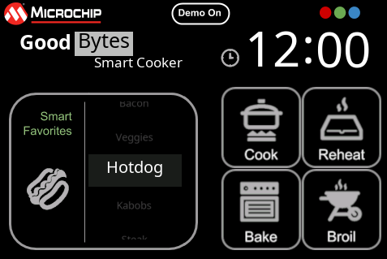

---
parent: Example Applications
title: Legato Cooker
nav_order: 1
---

# Legato Cooker

This demonstration provides a touch-enabled cooker UI.

|MPLABX Configuration|Board Configuration|
|:-------------------|:------------------|
| [legato_ck_e54_cult_cpro_parallel.X](firmware/legato_ck_e54_cult_cpro_parallel_X/readme.md)| [SAM E54 Curiosity Ultra Development Board](https://www.microchip.com/Developmenttools/ProductDetails/DM320210) using external ILI9488 controller to drive the [maXTouch® Curiosity Pro Board](https://www.microchip.com/Developmenttools/ProductDetails/AC320007) |