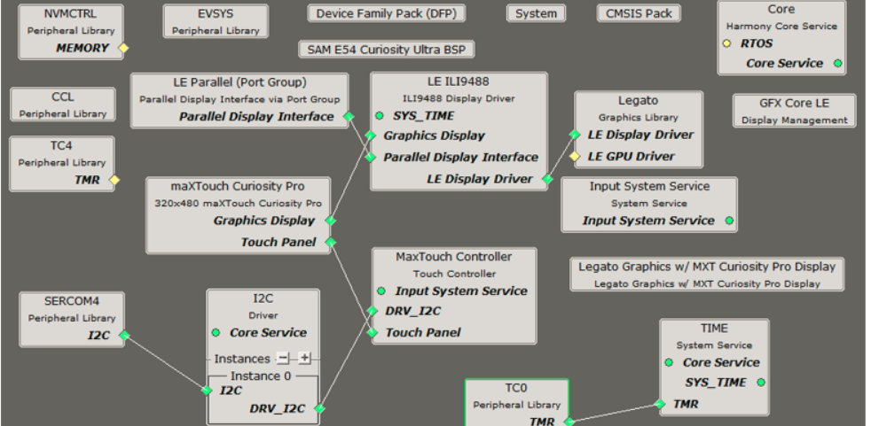
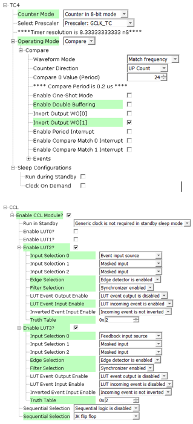
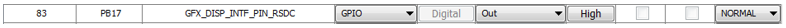

 legato_qs_e54_cult_cpro_parallel.X

Defining the Architecture
-------------------------

This application demonstrates single-layer HVGA graphics.

User touch input on the display panel is received thru the PCAP capacitive touch controller, which sends a notification to the Touch Input Driver. The Touch Input Driver reads the touch information over I2C and sends the touch event to the Graphics Library thru the Input System Service.

### Demonstration Features 

* Legato Graphics Library 
* ILI9488 display 8-bit parallel mode driver, optimized DMA-CCL mode 
* Time system service, timer-counter peripheral library and driver 
* 16-bit RGB565 color depth support (65535 unique colors) 
* CCL, DMA, PORT, EVSYS peripheral 
* RAW, RAW RLE images 

Creating the Project Graph
--------------------------

The Project Graph diagram shows the Harmony components that are included in this application. Lines between components are drawn to satisfy components that depend on a capability that another component provides.

Adding the **SAM E54 Curiosity Ultra BSP** and **Legato Graphics w/ MXT Curiosity Pro Display** Graphics Template component into the project graph will automatically add the components needed for a graphics project and resolve their dependencies. It will also configure the pins needed to drive the external peripherals like the display and the touch controller.  

For the DMA-CCL boosted setup, components TC4, CCL needs to be added. 

Additional components to support File System, MSD Client Driver, USB Full Speed Driver, USB Host Layer, SDMMC, SDHC1, QSPI and SST26 needs to be added and connected manually. 

Some of these components are fine with default settings, while other require some changes. The following is a list of all the components that required custom settings. 

To setup the CCL to clock the pixel data, make sure PB09 is set to CCL_OUT2 

Instead of write strobe, make sure PB17 is setup as RSDC instead

Building the Application
------------------------

The parent directory for this application is apps/legato_quickstart. To build this application, use MPLAB X IDE to open the apps/legato_quickstart/firmware/legato_qs_e54_cult_cpro_parallel.X project file. 

The following table lists configuration properties:

| Project Name  | BSP Used |Graphics Template Used | Description |
|---------------| ---------|---------------| ---------|
| legato_qs_e54_cult_cpro_parallel.X | SAM E54 Curiosity Ultra BSP | Legato Graphics w/ Xplained Pro Display | SAM E54 Curiosity Ultra w/ maXTouch Xplained Pro display via 8-bit parallel interface |

> \*\*\_NOTE:\_\*\* This application may contain custom code that is marked by the comments // START OF CUSTOM CODE ... and // END OF CUSTOM CODE. When using the MPLAB Harmony Configurator to regenerate the application code, use the "ALL" merging strategy and do not remove or replace the custom code.

Configuring the Hardware
------------------------

The final setup should be: 

Running the Demonstration
-------------------------

When power-on is successful, the demonstration will display a similar menu to that shown in the following figure (different configurations may have slight variation in the screen aspect ratio. 

* * * * *
