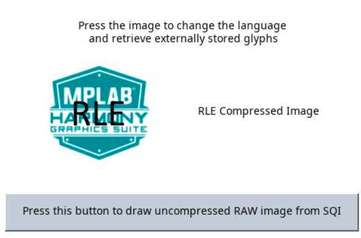

 legato_qs_x_r_e54_cult_cpro_parallel.X

Defining the Architecture
-------------------------

The legato_quickstart_external_resources (external flash reader) application uses the reads previously programmed binary data from the external non-volatile QSPI memory. The Graphics Library is used to render graphics to the scratch buffer. Via the ILI9488 Display Driver, boosted with a combination of DMA and CCL peripherals, scratch buffer data is transferred out to the ILI9488 controller via 8-bit parallel in 8080 mode. 

The application also features user touch input through the integrated touch screen on the display panel. Touch input from the touch controller goes through the I2C port, and the Input System Service acquires the touch input information from the Touch and I2C drivers. The Input System Service sends touch events to the Graphics Library, which processes these events and updates the frame data accordingly. 

This configuration runs on the SAM E54 Curiosity Ultra with maXTouch Curiosity Pro Display. 

User touch input on the display panel is received thru the PCAP capacitive touch controller, which sends a notification to the Touch Input Driver. The Touch Input Driver reads the touch information over I2C and sends the touch event to the Graphics Library thru the Input System Service. 

The application reads the binary data from the external non-volatile memory via the QSPI peripheral configured with the SST26 driver. 

### Demonstration Features 

* Legato Graphics Library 
* Input system service and touch driver 
* Time system service, timer-counter peripheral library and driver 
* ILI9488 display 8-bit parallel mode driver (DMA-CCL boosted) 
* 16-bit RGB565 color depth (8-bit palettized double buffering) 
* Port/GPIO peripheral 
* I2C peripheral library and driver 
* SST26 QSPI driver 
* Images and Fonts for user interface stored in internal flash

Creating the Project Graph
--------------------------

Adding the **SAM E54 Curiosity Ultra BSP** and **Legato Graphics w/ MXT Curiosity Pro Display** Graphics Template component into the project graph. 

This will automatically add the components needed for a graphics project and resolve their dependencies. It will also configure the pins needed to drive the external peripherals like the display and the touch controller. 

For the DMA-CCL boosted setup, components TC4, CCL needs to be added. 

Additional components to support File System, MSD Client Driver, USB Full Speed Driver, USB Host Layer, SDMMC, SDHC1, QSPI and SST26 needs to be added and connected manually. 

Some of these components are fine with default settings, while other require some changes. The following is a list of all the components that required custom settings. 

For QSPI access, make sure all 7 pins for QSPI is mapped.

To setup the CCL to clock the pixel data, make sure PB09 is set to CCL_OUT2 

Instead of write strobe, make sure PB17 is setup as RSDC instead

Building the Application
------------------------

The parent directory for this application is gfx/apps/legato_quickstart_ext_res. To build this application, use MPLABX to open the gfx/apps/legato_quickstart_ext_res/firmware/legato_qs_x_r_e54_cult_cpro_parallel.X project file. 

The following table lists configuration properties:

| Project Name  | BSP Used |Graphics Template Used | Description |
|---------------| ---------|---------------| ---------|
| legato_qs_x_r_e54_cult_cpro_parallel.X | SAM E54 Curiosity Ultra BSP | Legato Graphics w/ Xplained Pro Display | SAM E54 Curiosity Ultra w/ maXTouch Xplained Pro display via 8-bit parallel interface |

> \*\*\_NOTE:\_\*\* This application may contain custom code that is marked by the comments // START OF CUSTOM CODE ... and // END OF CUSTOM CODE. When using the MPLAB Harmony Configurator to regenerate the application code, use the "ALL" merging strategy and do not remove or replace the custom code.

Configuring the Hardware
------------------------

This section describes how to configure the supported hardware. 

Configure the hardware as follows: 

* Attach the 24-bit pass through card to the GFX Connector on the SAM E54 Curiosity Ultra board. 
* Connect the ribbon cable from the maXTouch Curiosity Pro Display to the ribbon connector on the 24-bit pass through card. Make sure that the S1 switch on the 24-bit pass through card is set to 2. 
* On the backside of the maXTouch Curiosity Pro display, set the IM[2:0] switches to **011** for 8-bit MCU mode. 
* Connect a USB cable from the host computer to the DEBUG USB port on the SAM E54 Curiosity Ultra board. This USB connection is used for code download and debugging. 
* Connect 5.5V power supply to the SAM E54 Curiosity Ultra board is optional 

For media stored on USB device: 

* Connect the USB MSD device to the **Target USB** USB micro port. This can be connected before or at any point after the application is powered-on.

The final hardware setup should be: 

Running the Demonstration
-------------------------

When power-on is successful, the following screen will appear on the display 

Pressing the button will cause the application to load a new image. The image cycles in order from Uncompressed RAW with Direct Blit, Uncompressed RAW, Run-Length Encoded (RLE) RAW, to JPEG.

The MPLAB Harmony Graphics Suite logo is also a button. Pressing the logo will toggle the application between English and Simplified Chinese. 

Note that all images and glyphs are retrieved from external NVM via QSPI. The application is purposely setup in single-buffer configuration to allow visual inspection of the data retrieval speed of the various images and glyphs.

* * * * *
