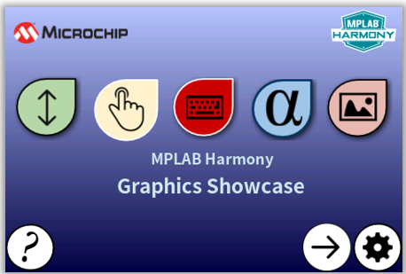
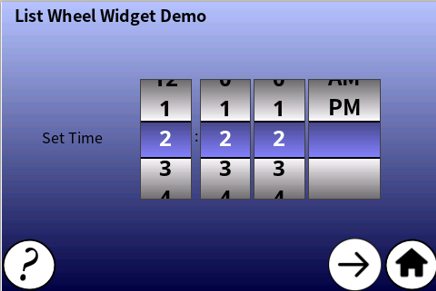
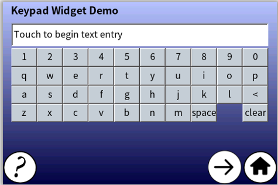
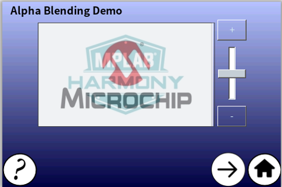

 legato_sc_e54_cu_cpro_parallel.X

Defining the Architecture
-------------------------

The block diagrams below show the various software and hardware blocks used in this application. 

The legato_showcase application uses the Legato Graphics Library to render graphics to the display. The Legato graphics library draws the updated sections of the frame to an internal scratch buffer. The contents of the scratch buffer are used to update the contents of the LCD display. The application also features user touch input through the integrated touch screen on the display panel. Touch input from the touch controller goes through the I2C port, and the Input System Service acquires the touch input information from the Touch and I2C Drivers. The Input System Service sends touch events to the Graphics Library, which processes these events and updates the frame data accordingly. 

Finally, the application uses the Timer System Service and driver to send timer events for transitioning images in the Slideshow Demo at specified intervals. 

User touch input on the display panel is received thru the PCAP capacitive touch controller, which sends a notification to the Touch Input Driver. The Touch Input Driver reads the touch information over I2C and sends the touch event to the Graphics Library thru the Input System Service.  

### Demonstration Features 

* Legato Graphics Library 
* ILI9488 display 8-bit parallel mode driver 
* Time system service, timer-counter peripheral library and driver 
* 16-bit RGB565 color depth support (65535 unique colors) 
* Port/GPIO peripheral 
* Graphics widgets: List wheel, Touch Test, Keypad, Slideshow 
* Alpha-blending 

Creating the Project Graph
--------------------------

Adding the **SAM E54 Curiosity Ultra BSP** and **Legato Graphics w/ MXT Curiosity Pro Display** Graphics Template component into the project graph.

This will automatically add the components needed for a graphics project and resolve their dependencies. It will also configure the pins needed to drive the external peripherals like the display and the touch controller.

For the DMA-CCL boosted setup, components TC4, CCL needs to be added.

Additional components to support File System, MSD Client Driver, USB Full Speed Driver, USB Host Layer, SDMMC, SDHC1, QSPI and SST26 needs to be added and connected manually.

Some of these components are fine with default settings, while other require some changes. The following is a list of all the components that required custom settings.

To setup the CCL to clock the pixel data, make sure PB09 is set to CCL_OUT2

Instead of write strobe, make sure PB17 is setup as RSDC instead

Building the Application
------------------------

The parent directory for this application is gfx_apps/legato_showcase. To build this application, use MPLAB X IDE to open the gfx_apps/legato_showcase/firmware/legato_sc_e54_cult_xpro_parallel.X project file. 

The following table lists configuration properties: 

| Project Name  | BSP Used |Graphics Template Used | Description |
|---------------| ---------|---------------| ---------|
| legato_sc_e54_cult_xpro_parallel.X | SAM E54 Curiosity Ultra BSP | Legato Graphics w/ Xplained Pro Display | SAM E54 Curiosity Ultra w/ maXTouch Xplained Pro display via 8-bit parallel interface |

> \*\*\_NOTE:\_\*\* This application may contain custom code that is marked by the comments // START OF CUSTOM CODE ... and // END OF CUSTOM CODE. When using the MPLAB Harmony Configurator to regenerate the application code, use the "ALL" merging strategy and do not remove or replace the custom code.

Configuring the Hardware
--------------------------

This section describes how to configure the supported hardware. 

Configure the hardware as follows: 

* Attach the 24-bit pass through card to the GFX Connector on the SAM E54 Curiosity Ultra board. 
* Connect the ribbon cable from the maXTouch Curiosity Pro Display to the ribbon connector on the 24-bit pass through card. Make sure that the S1 switch on the 24-bit pass through card is set to 2. 
* On the backside of the maXTouch Curiosity Pro display, set the IM[2:0] switches to �011� for 8-bit MCU mode. 
* Connect a USB cable from the host computer to the DEBUG USB port on the SAM E54 Curiosity Ultra board. This USB connection is used for code download and debugging. 
* Connect 5.5V power supply to the SAM E54 Curiosity Ultra board is optional 

The final hardware setup should be: 

Running the Demonstration
--------------------------

The app first boots to the animation Splash Screen. Once the Splash Screen animation completes, the Home Screen is shown:

Touching the (?) icon opens a Help Screen that describes the functions of the buttons in the Home Screen.

Touching (X) closes the Help Screen and returns to the Home Screen. 

The List Wheel Widget Demo Screen shows an example on how the list wheel widget can be used to provide UI controls for changing the time. The list wheel widget supports momentum where the user can �flick� on the widget to quickly go through the list.

The Touch Test Widget Demo Screen shows the Touch Test Widget, and how it can be used to verify touch screen functionality during product development.

When the white active area of the Touch Test Widget is touched, intersecting horizontal and vertical lines indicate the touch points. 

The Keypad Widget Demo Screen shows how the keypad and text entry widgets can be used to provide an interface for users to input text.

The Alpha Blending Demo screen shows the alpha blending capabilities of the Legato Graphics library. The demo features two JPEG images that are alpha blended on top of each other. The (+) and (-) buttons and the slider widget on the right side of the images provides a way to change the alpha amounts.

The Slide Show Demo Screen features the slide show widget being used to transition between several images using the available controls. 
 

Touching the LEFT (<) and RIGHT (>) buttons manually transitions through the list of images. Touching the PLAY (|>) and FAST-FORWARD (|>>) buttons will automatically transition the images at 2s and 500ms intervals, respectively. The transitions are triggered using events from the system timer service. 

Help information for the demo screens can be accessed by touching the (?) button on the lower left corner of each screen. Touching the HOME button on the lower right corner takes the application back to the Home Screen.
* * * * *
