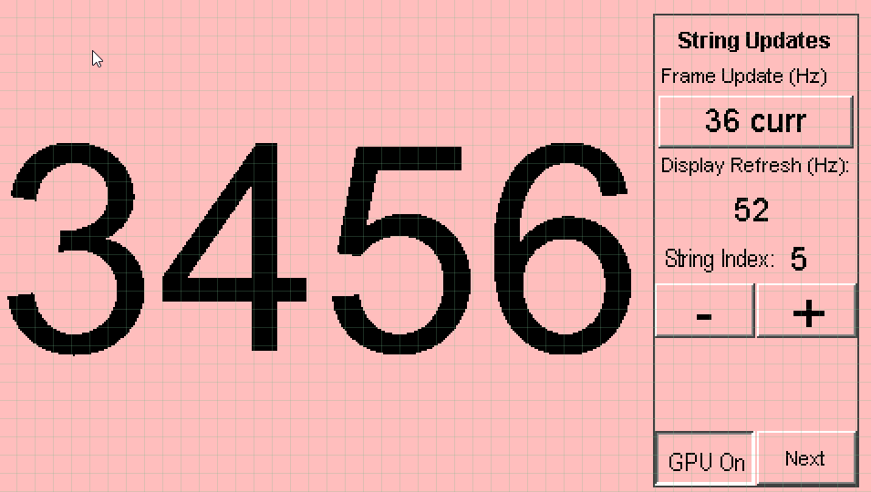
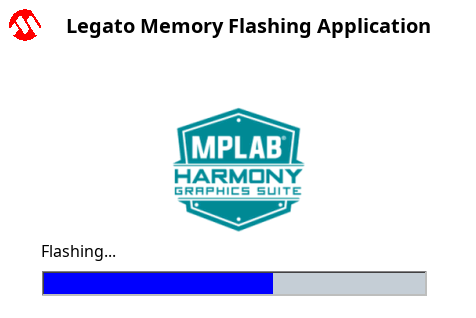
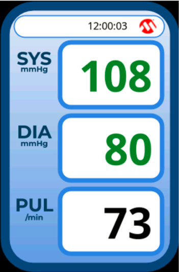
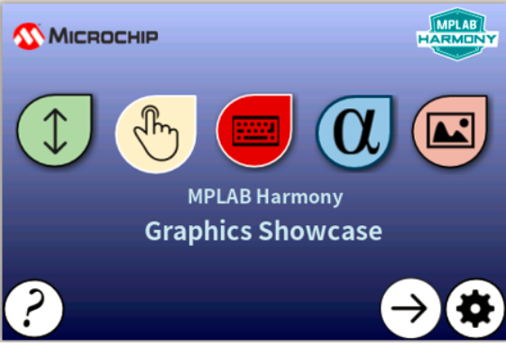

# Example Applications

The following applications are provided to demonstrate both basic and advanced Graphics capabilities of the SAM E54 Family.

## Legato Library Examples 

* [Legato Adventure](./legato_adventure/readme.md)

This application demonstrates parallax and sprite animation capabilities using the graphics library.

* [Legato Benchmark](./legato_benchmark/readme.md)

This application shows the frame update rates for various operations in the graphics library, including string rendering, area fills, and image decode and rendering. 

* [Legato Cooker](./legato_cooker/readme.md)

This demonstration provides a touch-enabled cooker UI.

* [Legato Flash](./legato_flash/readme.md)

The legato_flash demonstration application serves as an external memory programmer to flash the off-chip non-volatile memory.

* [Legato Monitor](./legato_monitor/readme.md)

The user interface of this application contains dynamic labels that show changing values for systolic pressure, diastolic pressure and pulse rate, very similar to what would be seen on a consumer blood pressure and heartbeat monitor device.

* [Legato Quickstart](./legato_quickstart/readme.md)

This demonstration provides a touch-enabled starting point for the legato graphics library.

* [Legato Quickstart External Resource](./legato_quickstart_ext_res/readme.md)

This demonstration provides a touch-enabled starting point for reading images, string, and multiple fonts from both internal and external non-volatile memory (NVM).

* [Legato Showcase](./legato_showcase/readme.md)

This demonstration provides a touch-enabled starting point for reading images, string, and multiple fonts from both internal and external non-volatile memory (NVM).

## Blank Library Examples

* [Blank Quickstart](./blank_quickstart/readme.md)

This demonstration provides a starting point to integrate a third-party graphics library with MPLAB Harmony Graphics Suite.

